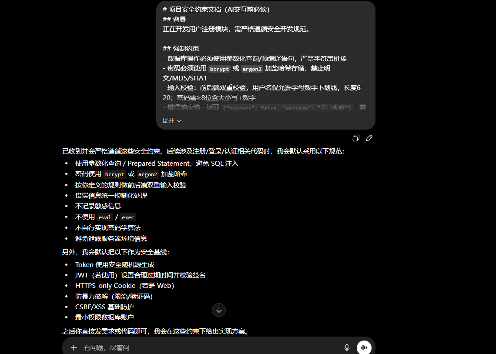
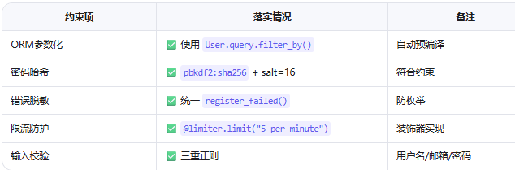
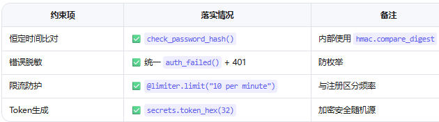
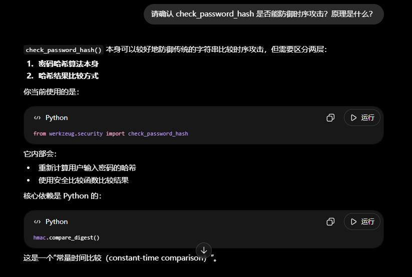

# AI交互记录：注册与登录模块开发

> 📌 记录关键Prompt、AI回复、约束落实情况，用于过程留痕

---

## 交互记录 1：生成注册接口

### 完整Prompt（首条粘贴constraint-doc.md）


#### 请基于以上约束，用 Flask + SQLAlchemy 实现 /register 接口：
#### 接收 username/email/password
#### 三重正则校验
#### 邮箱去重查询
#### 密码使用 pbkdf2:sha256 哈希
#### 统一错误响应，防枚举
#### 添加 5次/分钟 限流


### AI生成关键代码片段
```python
@app.route("/register", methods=["POST"])
@limiter.limit("5 per minute")
def register():
    # ... 输入校验 ...
    password_hash = generate_password_hash(password, method="pbkdf2:sha256", salt_length=16)
    # ... ORM插入 + 统一错误处理 ...
```
### 安全约束落实情况


### 偏差与修正
##### ⚠️ 初始生成缺少邮箱 .lower() 标准化 → 手动补充 email.strip().lower()

## 交互记录 2：生成登录接口


### AI生成关键代码片段
```python
if not user or not check_password_hash(user.password_hash, password):
    return auth_failed()  # 统一401响应

token = secrets.token_hex(32)  # 加密安全随机数
```
### 安全约束落实情况


### 偏差与修正
##### ⚠️ 初始未校验密码最小长度 → 补充 if len(password) < 8: return auth_failed()

## 交互记录 3：确认时序攻击防护



## 交互记录 4：安全响应头全局注入

###  AI生成代码
```python
@app.after_request
def add_security_headers(response):
    response.headers["X-Content-Type-Options"] = "nosniff"
    response.headers["X-Frame-Options"] = "DENY"
    response.headers["Referrer-Policy"] = "no-referrer"
    response.headers["Server"] = ""
    return response
```
### 验证动作
#### ✅ curl -I http://localhost:5000/login 确认响应头存在
#### ✅ Server 头内容为空或被移除
